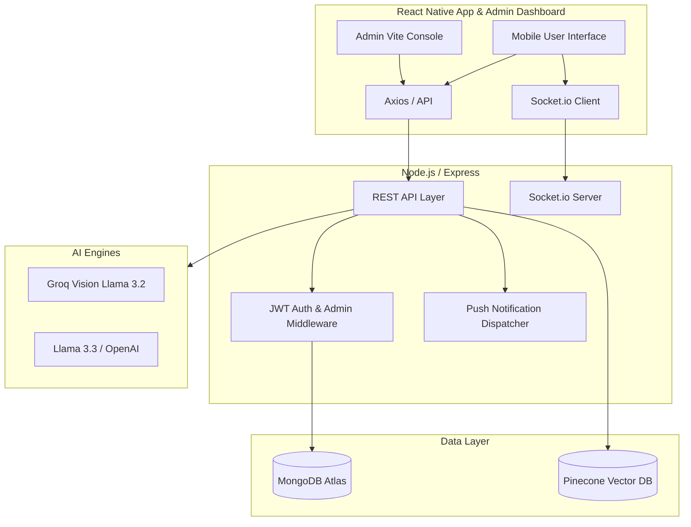

# EverythingBooking 🚀
### *The Ultimate AI-Powered Service Marketplace & Escrow Platform*

[](https://reactnative.dev/)
[](https://nodejs.org/)
[](https://www.mongodb.com/)
[](https://www.pinecone.io/)
[](https://opensource.org/licenses/MIT)

**EverythingBooking** is a high-performance, full-stack ecosystem designed to revolutionize how local services are discovered, booked, and verified. By combining **Generative AI**, **Semantic Vector Search**, **Escrow Wallet Protection**, and **Strict Administrative Control**, it bridges the trust gap between consumers and service providers in unregulated markets.

---

## 🧭 Table of Contents
- [Core Innovation Deep-Dives](#-core-innovation-deep-dives)
- [New Platform Features](#-new-platform-features)
- [System Architecture](#-system-architecture)
- [Tech Stack](#-tech-stack)
- [How It Works](#-how-it-works)
- [Database Schema](#-database-schema)
- [Installation & Setup](#-installation--setup)
- [Automated Integration Tests](#-automated-integration-tests)

---

## 🛡️ Core Innovation Deep-Dives

### 1️⃣ AI Image Verification (The Trust Engine)
Using **Groq Vision AI (Llama 3.2)**, we've implemented a verification layer. When a provider completes a job, they upload a photo. The AI analyzes the photo against the service description to ensure the work matches the request.
*   **Result**: "AI-Verified" badge on bookings, reducing fraud and disputes.

### 2️⃣ Semantic Vector Search
Traditional search fails on intent. We use **Pinecone** to store high-dimensional embeddings of service listings.
*   **Impact**: Users can search using natural language (e.g., *"help me with my sick cow"*) instead of specific technical terms, and the system understands the context (Medical -> Vet).

### 3️⃣ Real-Time Chat & Communications
Integrated **Socket.io** enables instant messaging between users. Messages are persisted in MongoDB to allow for seamless history tracking, while the real-time layer ensures no delay in communication.

---

## ✨ New Platform Features (Enhancements)

### 🔒 Strict Access Controls & Authentication
* **Admin Login Wall**: A dark-theme, glassmorphic login screen limits the Admin Console to users with authenticated `'admin'` roles.
* **Route Protection**: The backend enforces `adminAuth` middleware across all administrative endpoints, blocking unauthorized requests with `401 Unauthorized` or `403 Forbidden` responses.

### 🧑‍💼 Provider KYC Onboarding & Verification
* **IFSC Branch Code Validation**: Implements strict formatting rules for Indian bank codes (`^[A-Z]{4}0[A-Z0-9]{6}$`) with auto-capitalization.
* **Document Scanner**: Provider settings include a simulated ID document scanner. Submissions lock inputs and trigger manual admin review states.
* **Withdrawal Blocks**: Restricts payout requests until KYC status is verified.

### 💸 Escrow Payouts & Automated Refunds
* **Linked Details View**: Admin Payout dashboard renders complete UPI and Bank details for each provider.
* **Admin Approvals & Rejections**: Admins can approve payouts or reject them, automatically returning the debited funds back to the provider's wallet balance.

### ⚠️ Dispute Handlers & Audit Timelines
* **Dispute Reasons**: Providers submit custom explanations when raising disputes.
* **Timeline Auditing**: Administrative booking detail models populate custom dispute reasons directly in the verification audit trail.
* **Admin Override**: Admins can override disputes to force-complete bookings (releasing escrow funds and recording platform commission) or cancel bookings (triggering consumer refunds).

### 🔔 Real-Time Push Alerts
* Dispatch Expo push notifications instantly to user devices upon KYC approvals, KYC rejections, payout approvals, payout rejections, and booking disputes.

---

## 🏗 System Architecture



---

## 🛠 Tech Stack

| Layer | Technology |
| :--- | :--- |
| **Mobile Client** | React Native (Expo), React Navigation, Google Fonts (Inter) |
| **Admin Panel** | React (Vite), Glassmorphic Styling, Recharts, Lucide Icons |
| **Backend Server** | Node.js, Express.js, WebSockets (Socket.io) |
| **Databases** | MongoDB (Mongoose NoSQL), Pinecone (Vector Search) |
| **AI Orchestration** | Groq AI (Llama 3.3 / Llama 3.2 Vision), OpenAI |
| **Security & Alerts** | JWT (JSON Web Tokens), Bcrypt.js, Expo Push Notifications |

---

## ⚙️ How It Works

1.  **Onboarding**: Users register as either a **Consumer**, a **Provider**, or an **Admin**.
2.  **KYC Onboarding**: Providers set up bank/UPI details (validated with IFSC rules) and submit a mock ID scan. Admins approve or reject the request.
3.  **Creation**: Verified providers create listings. The **Listing Optimizer** polishes their descriptions using LLMs.
4.  **Discovery**: Consumers use **Semantic Search** or **Map View** to find services.
5.  **Booking & Escrow**: A confirmed booking locks funds in escrow. WebSockets initialize a private chat room.
6.  **Verification**: Upon completion, the provider uploads a photo. **Groq Vision AI** verifies the work, generating an "AI-Verified" badge.
7.  **Escrow Release**: Verification releases provider earnings minus the platform commission rate.
8.  **Withdrawal**: Providers request payouts to their bank accounts. Admins approve or deny the transaction.

---

## 🚀 Installation & Setup

### 1. Clone & Install
```bash
git clone https://github.com/khemanth11/BookingMate.git
cd BookingMate
```

### 2. Environment Variables
Create a `.env` in the `/Server` directory:
```env
PORT=5000
MONGODB_URI=your_mongodb_connection_string
JWT_SECRET=your_jwt_secret_key
GROQ_API_KEY=your_groq_api_key
PINECONE_API_KEY=your_pinecone_api_key
PINECONE_INDEX_NAME=listings
RAZORPAY_KEY_ID=your_razorpay_key
RAZORPAY_KEY_SECRET=your_razorpay_secret
```

### 3. Run the Servers
* **Start Backend Server**:
  ```bash
  cd Server
  npm install
  npm run dev
  ```
* **Start Admin Dashboard**:
  ```bash
  cd AdminDashboard
  npm install
  npm run dev
  ```
* **Start Mobile Client**:
  ```bash
  cd client
  npm install
  npx expo start
  ```

---

## 🧪 Automated Integration Tests

To verify all security checks, database models, KYC portals, and wallet escrow calculations programmatically:

1. Ensure the backend server is running.
2. In a new terminal window, navigate to the `Server` folder and execute:
   ```bash
   cd Server
   node test-integration.js
   ```

---

## 👨‍💻 Developed By
**K. Hemanth Kumar**  
*Building the future of connected services.*

---

> [!IMPORTANT]
> This project demonstrates mastery of **AI Orchestration**, **Real-time Event Handling**, **Escrow Wallet Financial Protections**, and **Secure Administrative Operations**. It is a fully scalable, production-grade service ecosystem.
