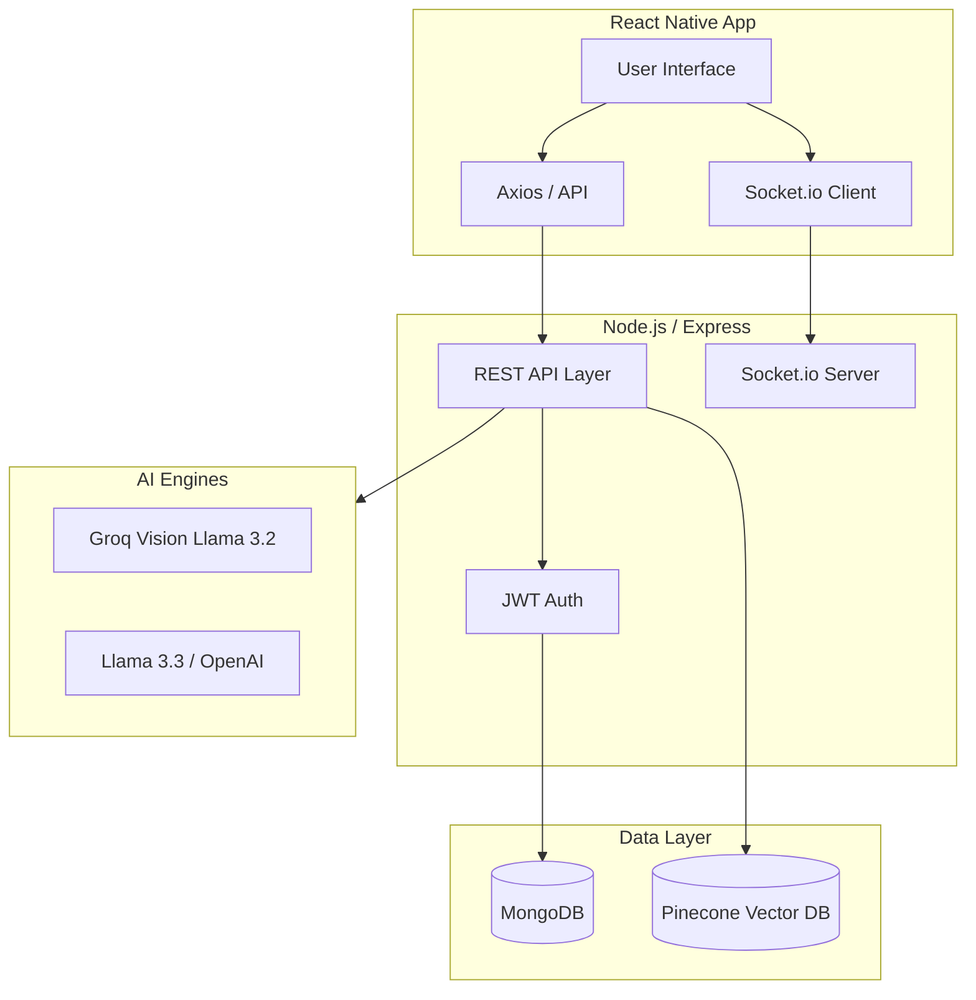

# EverythingBooking 🚀
### *The Ultimate AI-Powered Service Marketplace*

[](https://reactnative.dev/)
[](https://nodejs.org/)
[](https://www.mongodb.com/)
[](https://opensource.org/licenses/MIT)

**EverythingBooking** is a high-performance, full-stack ecosystem designed to revolutionize how local services are discovered, booked, and verified. By integrating cutting-edge **Generative AI** and **Vector Databases**, it solves the "trust gap" in unregulated service markets.

---

## 🧭 Table of Contents
- [Project Overview](#-project-overview)
- [System Architecture](#-system-architecture)
- [Core Innovation Deep-Dives](#-core-innovation-deep-dives)
- [Tech Stack](#-tech-stack)
- [How It Works](#-how-it-works)
- [Database Schema](#-database-schema)
- [Installation & Setup](#-installation--setup)

---

## 🌟 Project Overview
EverythingBooking isn't just a directory; it's a smart agent for your daily needs.

### 🏠 For Consumers
*   **Semantic Discovery**: Search for "I need someone to fix my leaking garden pipe" and get context-aware results, not just keyword matches.
*   **Live Marketplace**: Real-time availability tracking and map-based provider discovery.
*   **Frictionless Booking**: Integrated calendar system for scheduling and instant confirmation.

### 🏭 For Providers
*   **AI Business Assistant**: Convert messy, raw notes into professional, high-conversion listings automatically.
*   **Automated Verification**: Build trust with "AI-Verified" badges by submitting proof of work.
*   **Workspace Management**: Single-pane dashboard for managing multiple listings and incoming requests.

---

## 🏗 System Architecture



---

## 🛡 Core Innovation Deep-Dives

### 1️⃣ AI Image Verification (The Trust Engine)
Using **Groq Vision AI (Llama 3.2)**, we've implemented a verification layer. When a provider completes a job, they upload a photo. The AI analyzes the photo against the service description to ensure the work matches the request.
*   **Result**: "AI-Verified" badge on bookings, reducing fraud and disputes.

### 2️⃣ Semantic Vector Search
Traditional search fails on intent. We use **Pinecone** to store high-dimensional embeddings of service listings.
*   **Impact**: Users can search using natural language (e.g., "help me with my sick cow") instead of specific technical terms, and the system understands the context (Medical -> Vet).

### 3️⃣ Real-Time Persistence
Integrated **Socket.io** enables instant messaging between users. Messages are persisted in MongoDB to allow for seamless history tracking, while the real-time layer ensures no delay in communication.

---

## 🛠 Tech Stack

| Layer | Technology |
| :--- | :--- |
| **Mobile** | React Native (Expo), React Navigation |
| **Backend** | Node.js, Express.js |
| **Database** | MongoDB (NoSQL) |
| **Vector Search** | Pinecone |
| **Real-time** | Socket.io |
| **AI/ML** | Groq (Llama 3.3/3.2), OpenAI |
| **Security** | JWT (JSON Web Tokens), Bcrypt.js |

---

## ⚙️ How It Works

1.  **Onboarding**: Users register as either a **Consumer** or a **Provider**.
2.  **Creation**: Providers create listings. The **Listing Optimizer** polishes their descriptions.
3.  **Discovery**: Consumers use **Semantic Search** or **Map View** to find help.
4.  **Booking**: A confirmed booking creates a private chat room via **WebSockets**.
5.  **Execution**: Upon completion, the provider uploads a photo.
6.  **Verification**: **Groq Vision** verifies the work and updates the booking status to `completed`.

---

## 🗄 Database Schema

The system uses a highly relational NoSQL approach with Mongoose:
*   **Users**: Unified model with roles (Consumer/Provider).
*   **Listings**: Detailed service stats, average ratings, and location geodata.
*   **Bookings**: State management tracking (Pending -> Confirmed -> Completed).
*   **Messages**: Polymorphic chat data linked to specific booking IDs.
*   **Reviews**: Sentiment-tracked feedback for provider accountability.

---

## 🚀 Installation & Setup

### 1. Clone & Install
```bash
git clone https://github.com/yourusername/EverythingBooking.git
cd EverythingBooking
```

### 2. Environment Variables
Create a `.env` in the `/Server` directory:
```env
PORT=5000
MONGODB_URI=your_mongo_uri
JWT_SECRET=your_secret
GROQ_API_KEY=your_key
PINECONE_API_KEY=your_key
```

### 3. Run the Engines
**Start Backend:**
```bash
cd Server
npm install
npm run dev
```

**Start Mobile App:**
```bash
cd client
npm install
npx expo start
```

---

## 👨‍💻 Developed By
**Your Name**  
*Building the future of connected services.*

---

> [!IMPORTANT]
> This project demonstrates mastery of **AI Orchestration**, **Real-time Event Handling**, and **Modern Full-Stack Architecture**. It is a ready-to-scale production-grade solution.
